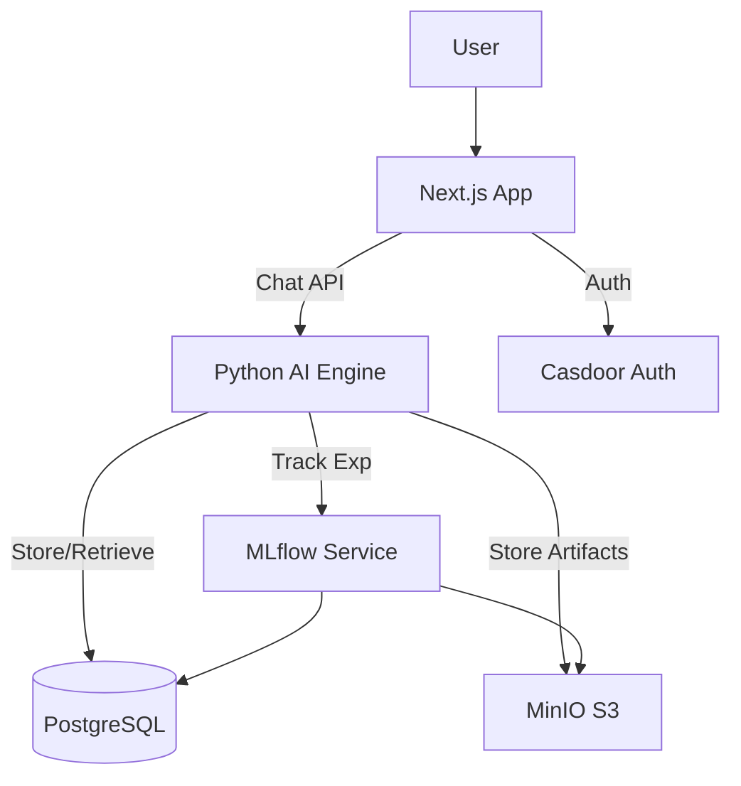

# Smart AI Assistant Platform - Technical Documentation

## 1. System Architecture

The platform follows a **Sidecar Architecture** pattern, integrating a high-performance Python AI Engine with the existing Next.js frontend.

### Components

1. **Frontend (Next.js)**: Handles UI/UX, chat interface, and user management.
2. **AI Engine (Python/FastAPI)**:
   - Exposes OpenAI-compatible APIs for custom model inference.
   - Manages RAG pipelines (document ingestion, embedding).
   - Runs evaluation pipelines.
3. **MLflow Service**:
   - Tracks experiments, metrics, and model versions.
   - Stores artifacts in MinIO (S3-compatible).
4. **Database (PostgreSQL)**:
   - `lobechat`: Stores chat history, users, settings.
   - `ai_engine`: Stores custom agent configs, evaluation results.
   - `mlflow`: Stores MLflow tracking metadata.
5. **Vector Store (PGVector)**: Stores embeddings for RAG.

### Diagram



## 2. AI Engine Internals

### Inference Pipeline

1. **Request**: `POST /v1/chat/completions`
2. **Preprocessing**: Validate input, retrieve context (if RAG enabled).
3. **Model Execution**:
   - If local model: Load via `transformers` or `vLLM`.
   - If proxy: Forward to external provider (e.g., OpenAI, Anthropic).
4. **Postprocessing**: Format response, stream tokens.
5. **Logging**: Log trace to MLflow.

### RAG Pipeline

1. **Upload**: `POST /v1/ingest/upload`
2. **Processing**: Extract text (PDF/Docx), chunking.
3. **Embedding**: Generate embeddings using local model (e.g., `all-MiniLM-L6-v2`).
4. **Storage**: Save to `pgvector`.

## 3. Database Schema (ERD)

### `ai_engine` Database

**Agents Table**

- `id`: PK
- `name`: String
- `system_prompt`: Text
- `model_config`: JSON (temp, top_p, model_name)
- `is_active`: Boolean

**Evaluations Table** (Planned)

- `id`: PK
- `agent_id`: FK
- `dataset_id`: String
- `metrics`: JSON (accuracy, toxicity_score)
- `created_at`: Timestamp

## 4. Deployment

The system is containerized using Docker Compose.

### Prerequisites

- Docker & Docker Compose
- NVIDIA Container Toolkit (for GPU support)

### Commands

```bash
# Start all services
docker compose up -d

# Rebuild AI Engine
docker compose build ai-engine
docker compose up -d ai-engine
```
